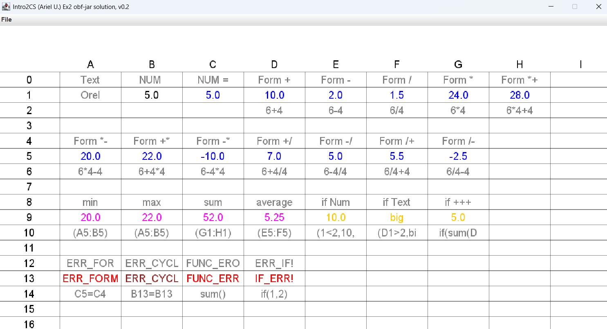

 **Ex4: Enhanced Spreadsheet Tool**  
*Course: Ariel University – Computer Science 2025A*

---

## Overview  
This project extends a basic spreadsheet system with support for mathematical expressions, conditional logic, and data range functions. It is part of the *Introduction to Computer Science (2025A)* course.

### Key Features:
-  Evaluate formulas with `+`, `-`, `*`, `/`,`<`,`>` and parentheses
-  Functions like `sum`, `min`, `max`, `average`, over 2D cell ranges
-  Conditional expressions using nested `if` logic
-  Cycle detection for formulas referencing each other
- Save/load spreadsheet content from text files

---
### Color Legend:
- **Black** – plain numbers or text values.
- **Blue** – calculated formulas or numbers starting with `=`.
- **Pink** – range functions (`min`, `max`, `average`, `sum`).
- **Yellow** – `if` expressions.
- **Red** – general errors (`ERR_FORM`, `FUNC_ERR`, `IF_ERR`).
- **Dark Red** – circular reference error (`ERR_CYCL`).

---
## Demo

[](https://youtu.be/0j_o3yKhASw)



## Features & Examples

### Range Functions:
```text
=sum(A1:C5)       → totals values
=min(B2:D4)       → minimum in range
=max(C1:D3)       → maximum in range
=average(A1:B2)   → average of cells
```

### Conditional Logic:
```text
=if(A1>10,High,Low)                            → basic comparison
=if(A1>10,if(B1<5,50,Check),Low)               → nested IF
=if(A1*A2!=A3/(2-A1),A2+2,A1+1)                 → formulas in condition
```

### Error Handling:
| Error       | Meaning |
|-------------|---------|
| `IF_ERR`    | Bad `if` format |
| `FUNC_ERR`  | Invalid function or bad range |
| `ERR_CYCLE` | Circular formula reference |
| `ERR_FORM`    | Invalid formula format |

---

## ✅ Valid Inputs:
```text
=if(A1>5,10,20)
=sum(A1:C3)
=if(A1*A2!=A3/(2-A1),A2+2,A1+1)
```

## ❌ Invalid Examples:
```text
=if(A1,5,10)             → condition must be comparison
=if(a1>1, 1)             → Missing if-false value.
=min(A1:B2, C1:C2)       → Multiple ranges not supported.
=sum(A1:)                → Invalid range.
=average(A1:B2,C1)       → Multiple ranges not supported.
=sumx(A1:B2)             → Unknown function name.
```

---

## Testing Scope
Includes full JUnit tests for:
- Formula parsing and operator precedence
- Range evaluation with edge cases
- `if` expressions including nested logic
- Circular reference detection
- Data updates and propagation

---

## 📁 Project Structure
```
Ex4/
├── src/ex4/
│   ├── Cell.java
│   ├── CellEntry.java
│   ├── CellEntryTest.java
│   ├── Ex2GUI.java
│   ├── Ex2Sheet.java
│   ├── Ex2SheetTest.java
│   ├── Ex2Utils.java
│   ├── Index2D.java
│   ├── Range2D.java
│   ├── Range2DTest.java
│   ├── SCell.java
│   ├── SCellTest.java
│   ├── Sheet.java
│   └── StdDrawEx2.java
├── README.md
└── test_save_load.txt / test_sheet.txt
```

---

## Submission  
- **Student ID**: 208748368  
- **Repository**: [https://github.com/Orelsalem21/Ex4.git](https://github.com/Orelsalem21/Ex4.git)

